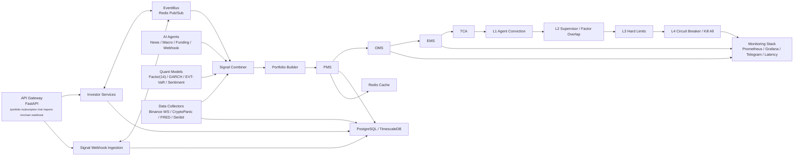

# Architecture

VINE is built as an **event-driven, async-first** system with 11 modular layers.

## System Diagram

## Module Overview

| Module | Purpose | Key Components |
| --- | --- | --- |
| **Core** | Infrastructure primitives | Types, Database, Redis, EventBus, Time Utils |
| **Data** | Market data ingestion | 5 collectors, ORM storage, quality validator |
| **Models** | Quantitative analytics | 14-factor model, GARCH, EVT, sentiment, slippage |
| **Agents** | Signal generation | News (Claude LLM), Macro Regime, Funding Rate |
| **Pipeline** | Trade execution flow | Signal Combiner → Portfolio → PMS → OMS → EMS → TCA |
| **Risk** | Position protection | 4-layer hierarchy, drawdown protocol, stress testing |
| **Backtest** | Strategy validation | Walk-forward, overfitting detection, performance metrics |
| **Monitoring** | Observability | Prometheus metrics, health checks, alerting |
| **Operations** | Business operations | NAV tracking, reporting, reconciliation |
| **API** | External interface | REST endpoints, JWT auth, webhook ingestion |
| **Config** | Runtime parameters | Settings, risk limits, agent params, hot reload |

## Data Flow

<Steps>
  <Step title="Ingestion (Real-Time)">
    5 data collectors feed prices (1-min OHLCV), news, macro indicators, options vol surfaces, and funding rates into PostgreSQL + Redis cache.
  </Step>
  <Step title="Signal Generation (Async)">
    AI agents and quant models process incoming data to produce directional signals with conviction scores (0-1) and exponential decay half-lives.
  </Step>
  <Step title="Signal Combination">
    `SignalCombiner` merges active signals: `w_target = Σ(weight_agent × conviction × direction × 0.5^(elapsed/half_life))`. Phase 1 weights: News 40%, Macro 60%.
  </Step>
  <Step title="Portfolio Construction">
    `PortfolioBuilder` applies volatility targeting (`σ_target / σ̂_garch`), regime overlay (position caps by macro regime), and leverage constraints.
  </Step>
  <Step title="Risk Check & Execution">
    Orders pass 4 risk layers. Approved orders execute via EMS (Market/TWAP/VWAP). TCA measures implementation shortfall.
  </Step>
  <Step title="Monitoring & Reporting">
    NAV snapshots every hour. Daily/weekly/monthly reports auto-generated. All actions logged to immutable audit trail.
  </Step>
</Steps>

## Technology Stack

| Layer | Technology |
| --- | --- |
| **Language** | Python 3.9+ (async/await) |
| **Web Framework** | FastAPI + Pydantic |
| **Database** | PostgreSQL 16 (TimescaleDB) |
| **Cache / Pub-Sub** | Redis 7 |
| **AI / LLM** | Anthropic Claude (Sonnet + Opus) |
| **Exchange** | CCXT (Binance, Deribit) |
| **Monitoring** | Prometheus + Grafana |
| **Alerts** | Telegram, Discord, Email |
| **Deployment** | Docker Compose, systemd |
